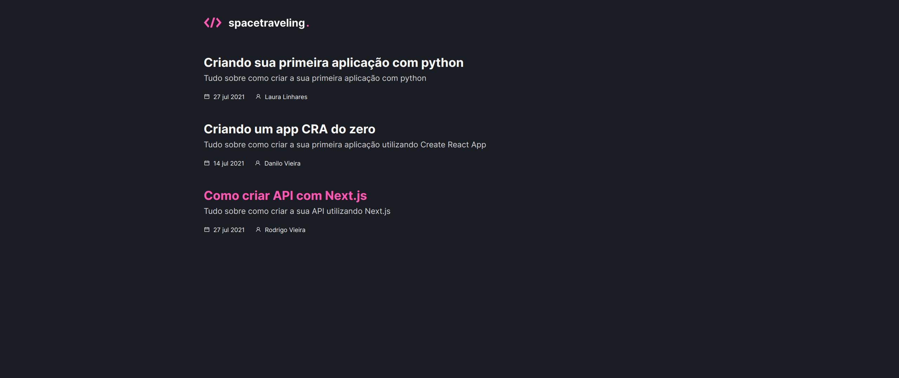

# spacetraveling



> spacetraveling é uma aplicação criada com Next.js e prismic CSM, essa aplicação foi o desafio da terceira semana do treinamento do ignite da Rocketseat, esse desafio consiste em criar posts no prismic CMS e depois mostra-los em um aplicação de posts de tecnologia. Os objetivos eram: Criar um botão para carregar mais posts, criar paginas estáticas com rotas dinâmicas para cada post e mostrar o tempo de leitura de cada post.

## 💻 Pré-requisitos

Antes de começar, verifique se você atendeu aos seguintes requisitos:

<!---Estes são apenas requisitos de exemplo. Adicionar, duplicar ou remover conforme necessário--->

- Você instalou a versão mais recente do `< node / npm ou yarn >`
- Você tem uma máquina `< Windows / Linux / Mac >`.

## 🚀 Instalando o projeto na sua maquina

Para instalar o projeto, siga estas etapas:

Linux e macOS:

```bash
git clone https://github.com/alextfonseca/ignite-template-reactjs-criando-um-projeto-do-zero.git

$ cd ignite-template-reactjs-criando-um-projeto-do-zero

$ yarn install ou npm install

$ yarn start ou npm start
```

Windows:

```bash
git clone https://github.com/alextfonseca/ignite-template-reactjs-criando-um-projeto-do-zero.git

$ cd ignite-template-reactjs-criando-um-projeto-do-zero

$ yarn install ou npm install

$ yarn start ou npm start
```

## 🧾 Usando o projeto

Com o projeto spacetraveling você pode ler posts sobre tecnologia:

# <a href="https://github.com/alextfonseca/ignite-template-reactjs-criando-um-projeto-do-zero">Acesse o projeto</a>

## 😄 Me siga nas redes sociais<br>

<p align="left">

  <a href="https://www.linkedin.com/in/alex-teixeira-da-fonseca-5a99931a2/" alt="Linkedin">
  </a>

  <a href="https://wa.me/+5511976184659?text=Olá%20Alex" alt="WhatsApp">
  </a>

  <a href="https://www.instagram.com/devalextf/?hl=pt-br" alt="Instagram">
  </a>
</p>
